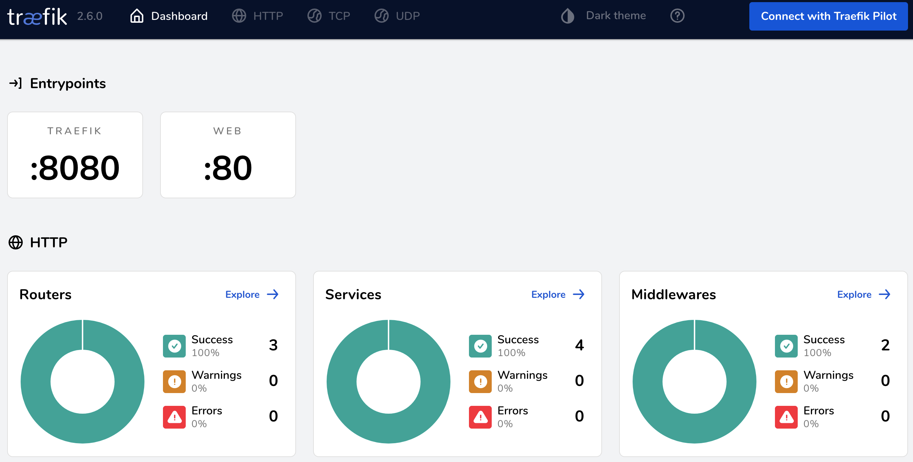

# FastApi / Docker / Traefik


## Usage

### Dev Environment
```shell
docker-compose up -d --build
```

- Browse ```http://fastapi.localhost:8008``` for web service 

- Using ```httpie```
    ```shell
    http http://0.0.0.0:8008 host:fastapi.localhost 
    ```

- Using ```curl```
    ```shell
    curl -H Host:fastapi.localhost http://0.0.0.0:8008
    ```

### Prod Environment
- Use ```Dockerfile.prod``` and ```Dockerfile.traefik``` as reference
- Letsencrypt won't work with ```localhost``` environment.  Need to have valid domain name and use a host in Cloud.

### Create requirements.txt for pip install
Use ```requirements.txt``` or generate your own by using the following command.
```shell
poetry export -f requirements.txt -o requirements.txt --without-hashes
```

## Traefik

Traefik is ```Reverse Proxy``` + ```Load balancer``` written in Golang.  
There are many advantages over Nginx such as automatically issues and renews TLS certificates via [Let's encrypt](https://letsencrypt.org).
Traefik is easier and simpler to use especially for Docker based micro-services such as for Kubernetes.

```http://fastapi.localhost:8081``` for Traefik dashboard.





## Troubleshoot

I have struggled to get Poetry working on Python 3.10.x. I think the reason was I have installed Poetry with Python 3.9.x and upgraded to 3.10.x

Run the following in Python virtual environment if you run into a trouble to run poetry.

```shell
pip install cleo tomlkit poetry.core requests cachecontrol cachy html5lib pkginfo virtualenv lockfile
```
